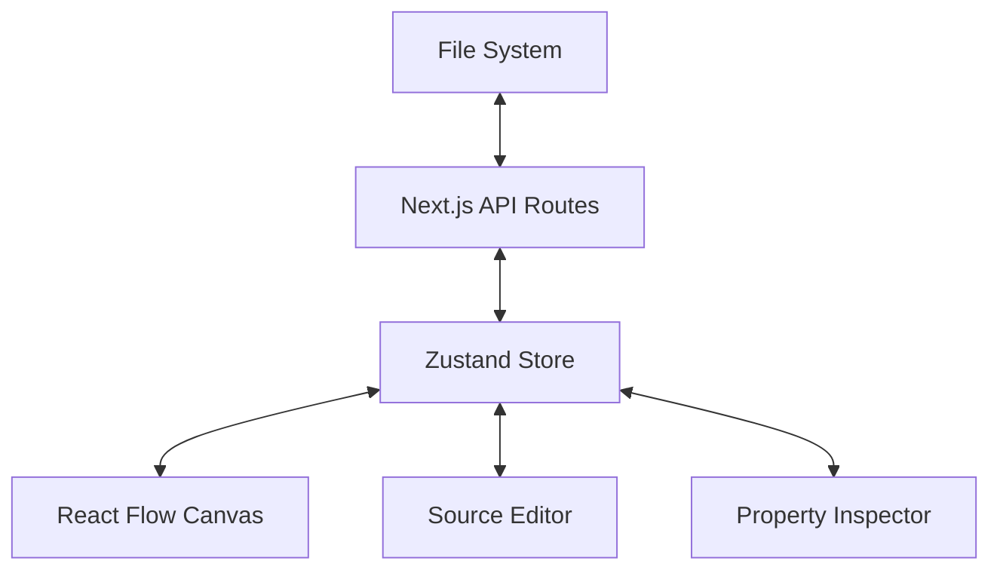

# Lobster-UI Architecture

## Overview

Lobster-UI is a file-centric workflow editor. It treats on-disk files as the source of truth, providing a visual layer for editing and dependency mapping.

## Data Management

### 1. Persistence
- **Workflows**: Saved as YAML or JSON.
- **Layouts**: Saved as `.lobster-ui.layout.[filename].json`. This prevents layout data from cluttering the execution-ready workflow files.

### 2. State & History
The application uses **Zustand** with a custom history implementation:
- `past`: Stack of previous `LobsterWorkflow` states.
- `future`: Stack of states for redo functionality.
- `updateWorkflow`: Commits a state to history and updates the active list.

### 3. Graph Projection
The translation from `LobsterWorkflow` to `ReactFlow` data occurs in `graph.ts`.
- **Nodes**: Inferred from the `steps` array.
- **Edges**: 
    - **Data Flow**: Inferred from `$stepId.stdout` references in `stdin`.
    - **Execution Flow**: Inferred from `condition` or `when` fields.
    - **Sequence**: Fallback dashed edges between sequential steps.

## API Design

- `GET /api/workflows?dir=...`: Recursive discovery and metadata extraction.
- `GET /api/workflows/[...path]`: Full file read and Zod validation.
- `PUT /api/workflows/[...path]`: Atomic file write (supports raw or structured).
- `GET/PUT /api/workflows/layout`: Metadata persistence for node positions.

## UI Principles

1.  **Non-destructive Editing**: Saving attempts to preserve the user's preferred format (YAML vs JSON).
2.  **Validation First**: Real-time Zod validation prevents saving corrupted workflow files.
3.  **Local-First**: No external database is required; the file system is the database.
