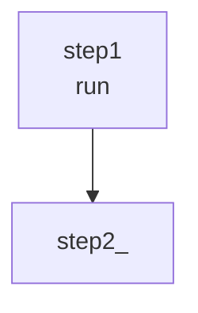

# API Reference

This document provides detailed documentation for all API routes in lobster-ui.

## Base URL

All API routes are prefixed with `/api/workflows`.

## Endpoints

### GET `/api/workflows`

Lists all workflow files in a specified directory.

**Query Parameters:**

| Parameter | Type | Required | Description |
|-----------|------|----------|-------------|
| `dir` | string | Yes | Directory path to scan for workflows |

**Example Request:**
```bash
curl "http://localhost:3000/api/workflows?dir=/path/to/workflows"
```

**Success Response (200):**
```json
{
  "workflows": [
    {
      "path": "/path/to/workflows/my-workflow.yaml",
      "name": "My Workflow",
      "steps": [
        { "id": "step1", "run": "echo 'Hello'" }
      ]
    }
  ]
}
```

**Error Response (400):**
```json
{
  "error": "Missing dir parameter"
}
```

---

### GET `/api/workflows?path=<path>`

Reads a single workflow file.

**Query Parameters:**

| Parameter | Type | Required | Description |
|-----------|------|----------|-------------|
| `path` | string | Yes | Absolute path to workflow file |

**Example Request:**
```bash
curl "http://localhost:3000/api/workflows?path=%2Fpath%2Fto%2Fworkflow.yaml"
```

**Success Response (200):**
```json
{
  "path": "/path/to/workflow.yaml",
  "workflow": {
    "name": "My Workflow",
    "description": "A sample workflow",
    "steps": [
      { "id": "step1", "run": "echo 'Hello'" }
    ]
  },
  "format": "yaml",
  "rawContent": "name: My Workflow\ndescription: A sample workflow\nsteps:\n  - id: step1\n    run: echo 'Hello'\n"
}
```

**Error Response (400):**
```json
{
  "error": "Missing path parameter"
}
```

**Error Response (404):**
```json
{
  "error": "File not found"
}
```

---

### PUT `/api/workflows?path=<path>`

Creates or updates a workflow file.

**Query Parameters:**

| Parameter | Type | Required | Description |
|-----------|------|----------|-------------|
| `path` | string | Yes | Absolute path for workflow file |

**Request Body:**

| Field | Type | Required | Description |
|-------|------|----------|-------------|
| `workflow` | object | Yes | Lobster workflow object |
| `format` | string | No | Format: "yaml" (default) or "json" |
| `rawContent` | string | No | Raw content to write (bypasses serialization) |

**Example Request:**
```bash
curl -X PUT "http://localhost:3000/api/workflows?path=%2Fpath%2Fto%2Fworkflow.yaml" \
  -H "Content-Type: application/json" \
  -d '{
    "workflow": {
      "name": "My Workflow",
      "steps": [{"id": "step1", "run": "echo 'Hello'"}]
    },
    "format": "yaml"
  }'
```

**Success Response (200):**
```json
{
  "success": true,
  "path": "/path/to/workflow.yaml"
}
```

**Error Response (400):**
```json
{
  "error": "Missing path parameter"
}
```

**Error Response (500):**
```json
{
  "error": "Validation error message"
}
```

---

### POST `/api/workflows/create`

Creates a new workflow file.

**Request Body:**

| Field | Type | Required | Description |
|-------|------|----------|-------------|
| `name` | string | Yes | Workflow name (converted to filename) |
| `dir` | string | Yes | Directory to create file in |
| `steps` | array | No | Initial steps array |

**Example Request:**
```bash
curl -X POST "http://localhost:3000/api/workflows/create" \
  -H "Content-Type: application/json" \
  -d '{
    "name": "My New Workflow",
    "dir": "/path/to/workflows"
  }'
```

**Success Response (200):**
```json
{
  "success": true,
  "path": "/path/to/workflows/my-new-workflow.yaml"
}
```

**Error Response (400):**
```json
{
  "error": "Missing name or dir"
}
```

---

### POST `/api/workflows/import`

Parses and validates workflow content without saving.

**Request Body:**

| Field | Type | Required | Description |
|-------|------|----------|-------------|
| `content` | string | Yes | Raw workflow content |
| `format` | string | No | "yaml" or "json", auto-detected if omitted |

**Example Request:**
```bash
curl -X POST "http://localhost:3000/api/workflows/import" \
  -H "Content-Type: application/json" \
  -d '{
    "content": "name: Imported Workflow\nsteps:\n  - id: step1\n    run: echo Hello",
    "format": "yaml"
  }'
```

**Success Response (200):**
```json
{
  "workflow": {
    "name": "Imported Workflow",
    "steps": [{"id": "step1", "run": "echo Hello"}]
  },
  "format": "yaml"
}
```

**Error Response (400):**
```json
{
  "error": "Missing content"
}
```

**Error Response (400):**
```json
{
  "error": "Parse error message"
}
```

---

### POST `/api/workflows/export`

Converts workflow to different formats.

**Request Body:**

| Field | Type | Required | Description |
|-------|------|----------|-------------|
| `workflow` | object | Yes | Workflow object |
| `format` | string | No | "yaml" (default), "json", "mermaid", "ts" |

**Example Request:**
```bash
curl -X POST "http://localhost:3000/api/workflows/export" \
  -H "Content-Type: application/json" \
  -d '{
    "workflow": {
      "name": "My Workflow",
      "steps": [{"id": "step1", "run": "echo Hello"}]
    },
    "format": "mermaid"
  }'
```

**Success Response (200):**
```json
{
  "content": "```mermaid\nflowchart TD\n  step1[\"step1\\nrun\"]\n```",
  "contentType": "text/plain",
  "filename": "My Workflow.md"
}
```

**Export Formats:**

#### YAML (default)
```yaml
name: My Workflow
steps:
  - id: step1
    run: echo Hello
```

#### JSON
```json
{
  "name": "My Workflow",
  "steps": [
    {"id": "step1", "run": "echo Hello"}
  ]
}
```

#### Mermaid


#### TypeScript
```typescript
export const workflow = {
  name: "My Workflow",
  steps: [{"id": "step1", "run": "echo Hello"}],
};
```

---

### GET `/api/workflows/layout?path=<path>`

Retrieves saved node positions for a workflow.

**Query Parameters:**

| Parameter | Type | Required | Description |
|-----------|------|----------|-------------|
| `path` | string | Yes | Workflow file path |

**Example Request:**
```bash
curl "http://localhost:3000/api/workflows/layout?path=%2Fpath%2Fto%2Fworkflow.yaml"
```

**Success Response (200):**
```json
{
  "nodes": {
    "workflow-metadata": { "x": 100, "y": 100 },
    "step1": { "x": 100, "y": 300 },
    "step2": { "x": 100, "y": 460 }
  }
}
```

**If no layout exists:**
```json
{
  "nodes": {}
}
```

---

### PUT `/api/workflows/layout?path=<path>`

Saves node positions for a workflow.

**Query Parameters:**

| Parameter | Type | Required | Description |
|-----------|------|----------|-------------|
| `path` | string | Yes | Workflow file path |

**Request Body:**

```json
{
  "nodes": {
    "step1": { "x": 100, "y": 300 },
    "step2": { "x": 250, "y": 450 }
  }
}
```

**Example Request:**
```bash
curl -X PUT "http://localhost:3000/api/workflows/layout?path=%2Fpath%2Fto%2Fworkflow.yaml" \
  -H "Content-Type: application/json" \
  -d '{
    "nodes": {
      "step1": {"x": 100, "y": 300},
      "step2": {"x": 250, "y": 450}
    }
  }'
```

**Success Response (200):**
```json
{
  "success": true
}
```

**Layout File Location:**

Layouts are saved as hidden files in the same directory as the workflow:
```
[workflow].yaml → .lobster-ui.layout.[workflow].yaml.json
```

---

## Error Handling

All API routes return consistent error responses:

| Status Code | Description |
|------------|------------|
| 400 | Bad Request - Missing or invalid parameters |
| 404 | Not Found - File not found |
| 500 | Server Error - Internal error |

**Error Response Format:**
```json
{
  "error": "Error message describing what went wrong"
}
```

## Authentication

Currently there is no authentication. The API is intended for local use only.

## Rate Limiting

No rate limiting is implemented.

## CORS

CORS is configured by Next.js. For local development, all origins are allowed.