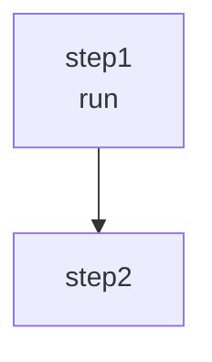

# Import/Export

This document describes import and export functionality.

## Export Formats

| Format | Extension | Content-Type |
|-------|-----------|--------------|
| YAML | .yaml | application/x-yaml |
| JSON | .json | application/json |
| Mermaid | .md | text/plain |
| TypeScript | .ts | text/plain |

## Export UI

Export options available in the header dropdown under the download icon.

## Import

Import via the upload icon in the header.

**Supported formats**: .yaml, .yml, .json

## Mermaid Export Example

